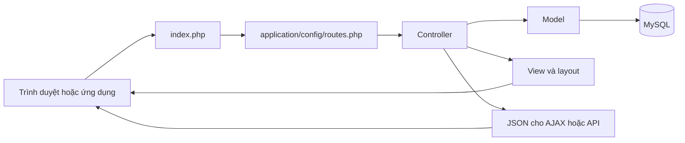

# Bản đồ project Saigon Cupid

Tài liệu được lập từ cấu trúc và mã nguồn tại workspace ngày 02/10/2026. Đây là phân tích tĩnh; chưa chạy website, kết nối database, gửi email hay thực thi các script cập nhật dữ liệu. Các file nghiệp vụ được mô tả riêng; thư viện bên thứ ba, bản dịch và tài nguyên ảnh được giải thích theo nhóm/quy luật tên file.

## 1. Project làm gì?

Website hẹn hò và kết nối thành viên: đăng ký, xác thực email, hồ sơ, tìm kiếm theo tiêu chí/khu vực, khám phá và thả tim, ghép đôi, chat, tâm sự, gợi ý mỗi ngày, chuỗi hoạt động, xu/VIP, tin đăng, tin tức và quản trị. Có API JSON dành cho ứng dụng di động.

Nền tảng là **PHP + CodeIgniter 3.1.13**, database MySQL, giao diện PHP/HTML/CSS và JavaScript thuần. Composer quản lý thư viện PHP. Chat có client WebSocket, đồng thời có cơ chế lấy tin qua HTTP theo chu kỳ; mã máy chủ WebSocket không nằm trong cấu trúc project đã kiểm tra.

Controller nhận yêu cầu và điều phối; model truy vấn dữ liệu và thực hiện nghiệp vụ; view dựng giao diện. Các thư viện `Userauth`, `Mailer`, `Emailer`, `Realtime` phục vụ những chức năng dùng chung.

## 2. File ở thư mục gốc

| File | Tác dụng |
|---|---|
| `index.php` | Điểm vào chính; đọc `.env`, chọn môi trường, xác định đường dẫn và khởi động CodeIgniter. CLI cũng đi qua file này khi chạy cron. |
| `.env.example` | Mẫu biến môi trường cho URL, database, khóa ứng dụng, SMTP và realtime. |
| `.env` nếu có | Cấu hình riêng của môi trường; không đưa vào Git. Không cần đưa giá trị bí mật vào tài liệu. |
| `.htaccess` | Apache chuyển URL động vào `index.php`, chặn truy cập trực tiếp một số thư mục mã nguồn và đặt cache tài nguyên tĩnh. |
| `.gitignore` | Loại cấu hình bí mật, thư viện cài bằng Composer, dữ liệu phát sinh và file tạm khỏi Git. |
| `composer.json` | Khai báo dependency, gồm Google API client; có dependency và script dành cho kiểm thử. |
| `composer.lock` | Khóa phiên bản dependency để cài đặt nhất quán. |
| `router-dev.php` | Router cho PHP development server; cho phục vụ file thật, đẩy URL động vào ứng dụng và chuẩn hóa biến đường dẫn script. |
| `dev-server.php` | Router phát triển khác; cho phục vụ trực tiếp file tĩnh không phải PHP. File bị `.gitignore` loại khỏi Git. |
| `API.md` | Tài liệu endpoint mobile, Bearer token, gợi ý ngày, lượt thích/xem hồ sơ và chuỗi hoạt động. Một số mô tả xác thực còn nói OTP, cần đối chiếu code. |
| `CAP-NHAT-SERVER.md` | Hướng dẫn cập nhật server, database, `.env`, SMTP và lịch cron. |
| `robots.txt` | Quy tắc crawler và địa chỉ sitemap. Khi server phục vụ trực tiếp file thật thì file này có thể được dùng trước controller `Robots`. |
| `ads.txt` | Khai báo bên được phép bán quảng cáo cho tên miền. |
| `google8f5f0ff1ce76e22f.html` | File xác minh quyền sở hữu website với Google. |
| `demo.webp` | Tài nguyên ảnh ở thư mục gốc; chưa xác nhận vị trí sử dụng trong luồng hiện tại. |
| `.DS_Store` | Metadata của macOS, không tham gia chạy website. |

## 3. Controller dùng chung

`application/core/MY_Controller.php` chứa **bốn lớp**, không chỉ một:

| Lớp | Tác dụng |
|---|---|
| `MY_Controller` | Chuẩn bị cấu hình, danh mục, khu vực, người dùng, thông báo, dữ liệu WebSocket; cập nhật hoạt động và chuỗi ngày; render layout frontend hoặc JSON; kiểm tra công tắc tin đăng. |
| `Member_Controller` | Kế thừa lớp trên, yêu cầu đăng nhập và kiểm tra tài khoản bị cấm; dùng cho khu tài khoản. |
| `Admin_Controller` | Kiểm tra quyền quản trị, render layout admin, nhận ảnh CKEditor và ghi nhật ký thao tác. |
| `Api_Controller` | Xử lý CORS, đọc JSON/form, trả kết quả/lỗi JSON, xác thực Bearer token bằng bản băm trong database và cập nhật hoạt động. |

## 4. Controller frontend — `application/controllers/`

| File | Tác dụng |
|---|---|
| `Home.php` | Chuẩn bị trang chủ và trang không tìm thấy. |
| `Auth.php` | Đăng ký, kiểm tra tuổi, đăng nhập/đăng xuất, gửi lại và sử dụng link xác thực email, quên và đặt lại mật khẩu. |
| `Account.php` | Tổng quan tài khoản, hồ sơ, onboarding, ảnh, tin đăng, danh sách thích, hội thoại, thông báo, người thích/xem mình, lịch sử gợi ý, chuỗi ngày, tùy chọn email, ví và đổi mật khẩu. |
| `Members.php` | Danh sách/tìm kiếm thành viên, hồ sơ công khai, chuyển URL hồ sơ cũ, mở thông tin liên hệ và bình luận hồ sơ. |
| `Discover.php` | Trang khám phá dạng thẻ; lấy ứng viên, thích, bỏ qua và hoàn tác. |
| `Dating.php` | Danh sách hồ sơ hẹn hò theo nhóm và bộ lọc. |
| `Confide.php` | Danh sách người muốn tâm sự; chủ đề, nhóm và sắp xếp. |
| `Areas.php` | Danh sách khu vực, hồ sơ theo tỉnh/thành và chuyển URL khu vực cũ sang URL mới. |
| `Posts.php` | Tin đăng, lọc theo danh mục/khu vực, chi tiết tin và mở liên hệ. Chịu công tắc bật/tắt tính năng tin đăng. |
| `Blog.php` | Danh sách và chi tiết bài tin tức. |
| `Pages.php` | Hiển thị trang nội dung theo slug, ví dụ trang giới thiệu/chính sách được lưu trong database. |
| `Ajax.php` | Endpoint cho thích/trả lời lượt thích, gửi và lấy tin nhắn, danh sách hội thoại, chat chung, thông báo, gợi ý ngày, báo cáo và bình luận tin. |
| `Email.php` | Hủy nhận email và ghi nhận lượt mở/bấm liên kết trong thư. |
| `Cron.php` | Chỉ chạy qua CLI: worker gửi thư, gợi ý ghép đôi, gom thông báo, tạo gợi ý ngày, nhắc chuỗi hoạt động, kéo người dùng quay lại và nhắc hoàn thiện hồ sơ. |
| `Sitemap.php` | Sinh sitemap XML tổng và các sitemap con cho trang, hẹn hò, tâm sự, khu vực và tin đăng. |
| `Robots.php` | Sinh nội dung robots động. Cần phân biệt với file `robots.txt` thật ở gốc. |

## 5. Controller mobile API — `application/controllers/api/`

| File | Tác dụng |
|---|---|
| `Auth.php` | Đăng nhập để cấp token, đăng xuất để thu hồi token, lấy thông tin người đang đăng nhập. |
| `Daily_match.php` | Lấy gợi ý hôm nay, thích/bỏ qua và xem lịch sử gợi ý. |
| `Engagement.php` | Người thích mình, phản hồi lượt thích, người xem hồ sơ, số lượng, chuỗi hoạt động và giữ chuỗi. Kiểm soát dữ liệu được mở cho VIP. |

## 6. Controller admin — `application/controllers/admin/`

| File | Tác dụng |
|---|---|
| `Auth.php` | Đăng nhập/đăng xuất quản trị. |
| `Dashboard.php` | Tổng quan và thống kê quản trị. |
| `Users.php` | Tìm/xem/sửa thành viên, đổi trạng thái, điều chỉnh xu, cấp VIP và xóa mềm. |
| `Posts.php` | Sửa/duyệt tin, xử lý hàng loạt, đánh dấu nổi bật và xóa tin/ảnh. |
| `Articles.php` | Danh sách, soạn/sửa/xóa bài tin tức và tải ảnh. |
| `Pages.php` | Danh sách, soạn/sửa/xóa trang nội dung và tải ảnh. |
| `Categories.php` | Quản lý danh mục. |
| `Provinces.php` | Quản lý tỉnh/thành. |
| `Jobs.php` | Quản lý danh sách nghề nghiệp. |
| `Banners.php` | Quản lý banner và ảnh banner. |
| `Packages.php` | Quản lý gói xu/VIP. |
| `Orders.php` | Danh sách đơn mua gói và cập nhật trạng thái thanh toán. |
| `Reports.php` | Xem/xử lý báo cáo vi phạm và thực hiện hành động kiểm duyệt. |
| `Codes.php` | Tạo/xóa và quản lý mã truy cập dùng chung. |
| `Settings.php` | Các nhóm cấu hình website và nhật ký quản trị. |
| `Emails.php` | Theo dõi hàng đợi và thống kê email. |

## 7. Model — `application/models/`

| File | Tác dụng |
|---|---|
| `M_user.php` | Hồ sơ/tài khoản, đăng ký, tìm kiếm và ứng viên khám phá, mức hoàn thiện hồ sơ, gợi ý, trạng thái, xu/VIP và thống kê. Model trung tâm của thành viên. |
| `M_interaction.php` | Thích/phản hồi, ghép đôi, xem hồ sơ, chặn, hội thoại, tin nhắn và trạng thái đã đọc. |
| `M_daily.php` | Tìm và lưu gợi ý mỗi ngày; thích/bỏ qua, hết hạn và lịch sử. |
| `M_streak.php` | Chấm công hoạt động theo ngày, mốc thưởng/huy hiệu, boost và lượt giữ chuỗi. |
| `M_post.php` | Truy vấn/tạo/sửa tin, ảnh tin, kiểm duyệt, nổi bật, xóa mềm, mở liên hệ và hết hạn. |
| `M_user_comment.php` | Bình luận hồ sơ, trả lời bình luận và xóa bình luận của người dùng. |
| `M_notification.php` | Tạo thông báo, gửi cho nhóm người, lấy danh sách, đếm và đánh dấu đã đọc. |
| `M_otp.php` | Tên giữ từ luồng OTP cũ; code hiện quản lý **link xác thực email**, băm token, thời hạn 48 giờ và chờ 60 giây trước khi gửi lại. |
| `M_email.php` | Tùy chọn nhận email, token hủy đăng ký, hàng đợi, kiểm tra điều kiện/tần suất gửi, retry, lượt mở/bấm và thống kê A/B. |
| `M_billing.php` | Gói xu/VIP, tạo đơn, xác nhận thanh toán, cấp quyền lợi, lịch sử xu và doanh thu. |
| `M_access_code.php` | Cấp, kiểm tra và sử dụng mã mở truy cập; quản lý mã dùng chung. |
| `M_report.php` | Tạo báo cáo vi phạm, danh sách/số lượng và cập nhật xử lý. |
| `M_article.php` | Bài viết xuất bản, slug, lượt xem và CRUD quản trị. |
| `M_category.php` | Danh mục, cây danh mục, tìm theo slug và CRUD. |
| `M_province.php` | Tỉnh/thành, slug, số thành viên/tin theo tỉnh và CRUD. |
| `M_job.php` | Danh mục nghề, kiểm tra tên hợp lệ/trùng tên, số thành viên liên quan và CRUD. |
| `M_banner.php` | Banner theo vị trí và CRUD. |
| `M_setting.php` | Đọc và cập nhật cấu hình website lưu trong database. |

## 8. Library và helper

| File | Tác dụng |
|---|---|
| `application/libraries/Userauth.php` | Kiểm tra mật khẩu, phiên đăng nhập, cookie ghi nhớ, người dùng hiện tại, quyền admin/VIP, xác thực email và cập nhật online. Được autoload với tên `auth`. |
| `application/libraries/Realtime.php` | Đọc URL/secret WebSocket và ký token kết nối; không phải máy chủ WebSocket. |
| `application/libraries/Mailer.php` | Dựng email HTML với layout, cấu hình người gửi, gửi qua thư viện Email và ghi lỗi. |
| `application/libraries/Emailer.php` | Chuẩn bị email theo sự kiện: chào mừng, tin nhắn, ghép đôi, lượt thích/xem, gợi ý, nhắc hồ sơ và quay lại. |
| `application/libraries/MY_Email.php` | Mở rộng kết nối SMTP/TLS của CodeIgniter, cho phép cấu hình kiểm tra chứng chỉ. |
| `application/libraries/PHPExcel.php` | Lớp thư viện làm việc với workbook Excel. Có file không đồng nghĩa đang được luồng nghiệp vụ sử dụng. |
| `application/helpers/app_helper.php` | Escape HTML, slug, flash, tuổi, nhãn dữ liệu, thời gian, avatar, định dạng tiền, che liên hệ/email, phân trang, tên hiển thị, cung hoàng đạo, số điện thoại, đồng bộ giờ DB, icon và tiến độ hồ sơ. |
| `application/helpers/func_helper.php` | Helper tiện ích khác: phân trang, quyền admin, slug/bỏ dấu, ngày và xử lý nội dung HTML. Cần kiểm tra nơi gọi trước khi sửa hoặc xóa. |
| `application/helpers/images_helper.php` | Lớp xử lý ảnh: thumbnail, resize/crop, watermark, xoay, lưu và đọc thông tin ảnh. |

## 9. Cấu hình — `application/config/`

| File | Tác dụng |
|---|---|
| `autoload.php` | Nạp database, session, form validation, `Userauth` dưới tên `auth`; helper URL/form/app. Khai báo cuối file ghi đè khai báo rỗng phía trên. |
| `config.php` | URL ứng dụng, charset, khóa mã hóa, cookie/session, logging và các tùy chọn nền tảng; chuẩn bị nơi lưu session và đặt giờ Việt Nam. |
| `routes.php` | Ánh xạ URL tiếng Việt, API và admin tới controller/method. Các route tỉnh/thành bắt rộng được đặt cuối file. |
| `database.php` nếu có | Kết nối database; bị Git ignore và có bản mẫu trong `config-example`. |
| `email.php` nếu có | Cấu hình SMTP; bị Git ignore và có bản mẫu trong `config-example`. |
| `constants.php` | Hằng số quyền file, chế độ mở file và mã thoát. |
| `hooks.php` | Khai báo hook can thiệp vòng đời framework. |
| `migration.php` | Cấu hình cơ chế migration của CodeIgniter; khác các script riêng trong `database/`. |
| `mimes.php` | Ánh xạ đuôi file và MIME, phục vụ xử lý upload/file. |
| `memcached.php` | Cấu hình server cho cache Memcached. |
| `profiler.php` | Cấu hình các mục hiển thị khi bật profiler. |
| `user_agents.php` | Danh sách nhận diện browser, hệ điều hành, bot và thiết bị. |
| `smileys.php` | Bảng ký hiệu mặt cười cho helper smiley. |
| `foreign_chars.php` | Bảng chuyển ký tự đặc biệt khi xử lý chuỗi/URL. |
| `doctypes.php` | Các khai báo doctype HTML/XHTML. |

`config-example/README.md` hướng dẫn dựng cấu hình. Từng file `autoload.php`, `config.php`, `constants.php`, `database.php`, `email.php`, `routes.php` trong thư mục này là bản mẫu cho file cùng tên ở `application/config/`; ứng dụng không mặc nhiên chạy trực tiếp bản mẫu.

## 10. View frontend — `application/views/`

| File | Tác dụng |
|---|---|
| `layouts/main.php` | Khung HTML chung, SEO/canonical, tài nguyên CSS/JS, điều hướng, footer, thông báo và chat. Nạp view nội dung theo `content_view`. |
| `layouts/_nudge.php` | Banner nhắc xác thực/hoàn thiện hồ sơ theo ưu tiên. |
| `layouts/_streak_pill.php` | Thành phần chuỗi hoạt động trên thanh điều hướng. |
| `_daily_card.php` | Thẻ gợi ý thành viên mỗi ngày. |
| `home/index.php` | Nội dung trang chủ. |
| `members/index.php` | Danh sách và bộ lọc tìm thành viên. |
| `members/profile.php` | Hồ sơ công khai, tương tác và bình luận. |
| `members/_card.php` | Thẻ thành viên tái sử dụng trong danh sách. |
| `discover/index.php` | Khung khám phá/swipe và điều khiển tương tác. |
| `discover/_card.php` | Thẻ hồ sơ lớn của ứng viên khám phá. |
| `dating/index.php` | Danh sách hẹn hò, nhóm và sắp xếp. |
| `confide/index.php` | Danh sách tâm sự, chủ đề và sắp xếp. |
| `confide/_card.php` | Thẻ hồ sơ dành riêng cho tâm sự. |
| `areas/index.php` | Danh sách tỉnh/thành. |
| `posts/index.php` | Danh sách và bộ lọc tin đăng. |
| `posts/detail.php` | Chi tiết tin đăng và thông tin liên hệ. |
| `posts/_card.php` | Thẻ tóm tắt một tin đăng. |
| `blog/index.php` | Danh sách bài tin tức. |
| `blog/detail.php` | Nội dung một bài tin tức. |
| `pages/view.php` | Nội dung trang tĩnh lấy từ database. |
| `auth/register.php` | Form đăng ký. |
| `auth/login.php` | Form đăng nhập. |
| `auth/check_email.php` | Hướng dẫn kiểm tra email và gửi lại link xác thực. |
| `auth/forgot.php` | Form yêu cầu đặt lại mật khẩu. |
| `auth/reset.php` | Form nhập mật khẩu mới. |
| `email/unsubscribe.php` | Trang hủy nhận email. |
| `errors/not_found.php` | Trang 404 của website. |

### View tài khoản — `application/views/account/`

| File | Tác dụng |
|---|---|
| `_shell.php` | Khung dùng chung cho trang tài khoản. |
| `_person.php` | Thành phần hiển thị một người trong khu tài khoản. |
| `index.php` | Trang tổng quan tài khoản. |
| `onboarding.php` | Hướng dẫn hoàn thiện hồ sơ ban đầu. |
| `profile.php` | Form sửa hồ sơ. |
| `photos.php` | Quản lý ảnh cá nhân. |
| `password.php` | Đổi mật khẩu. |
| `posts.php` | Danh sách tin của mình. |
| `post_form.php` | Form tạo/sửa tin. |
| `likes.php` | Danh sách quan tâm/lượt thích. |
| `who_liked_me.php` | Những người thích mình và phần nội dung giới hạn theo VIP. |
| `profile_viewers.php` | Những người xem hồ sơ. |
| `daily_history.php` | Lịch sử gợi ý ngày. |
| `streak.php` | Chuỗi hoạt động, huy hiệu và giữ chuỗi. |
| `messages.php` | Danh sách hội thoại và nội dung tin nhắn. |
| `notifications.php` | Danh sách thông báo. |
| `wallet.php` | Xu, gói mua và giao dịch. |
| `email_prefs.php` | Tùy chọn nhận email. |

### View admin — `application/views/admin/`

| File | Tác dụng |
|---|---|
| `layouts/main.php` | Khung admin, điều hướng và nạp tài nguyên quản trị. |
| `auth/login.php` | Form đăng nhập admin. |
| `dashboard.php` | Bảng tổng quan. |
| `users/index.php` | Danh sách/bộ lọc thành viên. |
| `users/view.php` | Chi tiết thành viên. |
| `users/edit.php` | Form sửa thành viên. |
| `posts/index.php` | Danh sách và công cụ kiểm duyệt tin. |
| `posts/edit.php` | Form sửa tin. |
| `articles/index.php` | Danh sách bài viết. |
| `articles/edit.php` | Form soạn/sửa bài viết. |
| `pages/index.php` | Danh sách trang nội dung. |
| `pages/edit.php` | Form soạn/sửa trang nội dung. |
| `categories/index.php` | Danh sách danh mục. |
| `categories/edit.php` | Form tạo/sửa danh mục. |
| `provinces/index.php` | Danh sách tỉnh/thành. |
| `provinces/edit.php` | Form tạo/sửa tỉnh/thành. |
| `jobs/index.php` | Danh sách nghề. |
| `jobs/edit.php` | Form tạo/sửa nghề. |
| `banners/index.php` | Danh sách banner. |
| `banners/edit.php` | Form tạo/sửa banner. |
| `packages/index.php` | Danh sách gói xu/VIP. |
| `packages/edit.php` | Form tạo/sửa gói. |
| `orders/index.php` | Danh sách đơn hàng và trạng thái. |
| `reports/index.php` | Danh sách báo cáo vi phạm. |
| `codes/index.php` | Danh sách và thao tác với mã truy cập. |
| `settings/index.php` | Các form cấu hình website. |
| `settings/logs.php` | Nhật ký thao tác admin. |
| `emails/index.php` | Theo dõi hàng đợi và hiệu quả email. |

### Mẫu email — `application/views/emails/`

| File | Tác dụng |
|---|---|
| `layout.php` | Khung email HTML chung, thương hiệu và footer. |
| `_cta.php` | Nút hành động dùng bố cục bảng để tương thích email client. |
| `welcome.php` | Thư chào mừng. |
| `verify_email.php` | Thư chứa link xác thực email. |
| `reset_password.php` | Thư đặt lại mật khẩu. |
| `new_message.php` | Báo có tin nhắn mới. |
| `notify_match.php` | Báo ghép đôi thành công. |
| `notify_like.php` | Tổng hợp lượt thích mới. |
| `notify_view.php` | Tổng hợp lượt xem hồ sơ. |
| `match_suggest.php` | Gợi ý người phù hợp. |
| `profile_nudge.php` | Nhắc hoàn thiện hồ sơ. |
| `re_engage.php` | Mời người lâu không hoạt động quay lại. |

### Mẫu lỗi và bản sao lưu

Trong cả `errors/html/` và `errors/cli/`, `error_404.php` báo không tìm thấy, `error_db.php` báo lỗi database, `error_exception.php` báo exception, `error_general.php` báo lỗi chung và `error_php.php` báo lỗi PHP. Bản HTML phục vụ web; bản CLI phục vụ dòng lệnh.

Các file `*.php.bak`, `main.php.bak2`, `_nav.php.bak` và `style.css.bak-truoc-khi-go-xung-dot` là bản sao lưu. Không được các lệnh load view/CSS đang đọc tự động chọn như file hiện hành. Không kết luận có thể xóa chỉ từ tên file.

## 11. CSS và JavaScript đang được layout nạp

| File | Tác dụng |
|---|---|
| `assets/site/css/style.css` | Kiểu giao diện chung của website. |
| `assets/site/css/account.css` | Kiểu dùng chung cho khu tài khoản. |
| `assets/site/js/app.js` | Tương tác chung: modal/thông báo, thao tác giao diện, chat trên trang, emoji, lấy tin theo chu kỳ và validation tiếng Việt. |
| `assets/site/js/chat-widget.js` | Khung chat nổi, danh sách hội thoại, chat riêng/chat chung, gửi/nhận và phối hợp realtime với polling. |
| `assets/site/js/realtime.js` | Client WebSocket, sự kiện, ping và kết nối lại khi mất kết nối. |
| `assets/site/js/notifications.js` | Khay chuông thông báo: tải danh sách, huy hiệu chưa đọc và đánh dấu đã đọc. |
| `assets/site/js/password-toggle.js` | Nút hiện/ẩn mật khẩu trên frontend. |
| `assets/site/js/searchable-select.js` | Ô chọn có tìm kiếm; dùng ở frontend và admin. |
| `assets/admin/css/admin.css` | Giao diện quản trị và responsive. |
| `assets/admin/js/admin.js` | Preview ảnh upload, nhãn bảng trên mobile và hộp xác nhận thao tác. |
| `assets/admin/js/editor.js` | Khởi tạo CKEditor, toolbar, upload ảnh và đồng bộ textarea khi submit. |
| `assets/admin/js/password-toggle.js` | Nút hiện/ẩn mật khẩu trong admin. |

Mỗi file dưới `assets/site/css/account/` định dạng trang cùng tên: `daily_history.css`, `email_prefs.css`, `likes.css`, `messages.css`, `notifications.css`, `onboarding.css`, `password.css`, `photos.css`, `post_form.css`, `posts.css`, `profile.css`, `profile_viewers.css`, `streak.css`, `wallet.css`, `who_liked_me.css`. Layout chọn CSS theo `basename($content_view)` nếu file tồn tại.

## 12. Database — `database/`

| File | Tác dụng |
|---|---|
| `schema.sql` | Tạo cấu trúc database và các bảng. Có `DROP TABLE`, chỉ thích hợp với thao tác cài mới có chủ đích. |
| `seed.sql` | Dữ liệu khởi tạo, gồm danh mục và dữ liệu cấu hình/nội dung mẫu. |
| `update.php` | Script cập nhật bản đã cài: thêm cấu hình, cột/bảng, tỉnh/thành, nghề, email, hồ sơ và các tính năng bổ sung; có tùy chọn tạo thành viên demo. Không chỉ đọc dữ liệu. |
| `migrate_provinces_2025.php` | Chuyển danh mục về 34 tỉnh/thành và chuyển các tham chiếu từ tỉnh cũ sang tỉnh kế thừa. |
| `jobs_list.php` | Danh sách nghề nghiệp dùng cho khởi tạo/cập nhật. |
| `fill_member_profiles.php` | Điền dữ liệu vào trường hồ sơ đang trống để bộ lọc có dữ liệu. Có thể tác động thành viên đang có, không chỉ tài khoản demo. |
| `seed_demo_users.php` | Tạo thành viên mẫu cho phát triển, email dạng `@demo.local`. |

Các nhóm bảng chính trong `schema.sql`:

- Danh mục: `provinces`, `jobs`, `categories`, `interests`.
- Thành viên: `users`, `user_photos`, `user_interests`, `user_preferences`, `user_tokens`, `api_tokens`.
- Tin đăng/liên hệ: `posts`, `post_images`, `post_contact_unlocks`, `access_codes`, `post_comments`, `user_comments`.
- Tương tác/chat: `likes`, `matches`, `blocks`, `user_passes`, `conversations`, `messages`, `room_messages`, `profile_views`.
- Gắn kết/email: `daily_matches`, `user_streaks`, `streak_badges`, `email_prefs`, `email_queue`, `notifications`.
- Thanh toán: `packages`, `orders`, `coin_transactions`.
- Nội dung/quản trị: `articles`, `pages`, `banners`, `settings`, `reports`, `admin_logs`.

## 13. Framework, dependency và tài nguyên đi kèm

### `system/`: mã CodeIgniter

- `core/CodeIgniter.php`: bootstrap/vòng đời request; `Common.php`: hàm nền tảng; `Controller.php` và `Model.php`: lớp cơ sở; `Loader.php`: nạp model/library/helper/view.
- `core/Router.php` và `URI.php`: định tuyến và phân tích URL; `Input.php`: dữ liệu request; `Output.php`: phản hồi; `Config.php`: cấu hình; `Security.php`: tiện ích bảo mật.
- `core/Exceptions.php`, `Log.php`, `Benchmark.php`, `Hooks.php`, `Lang.php`, `Utf8.php`: lỗi, log, đo thời gian, hook, ngôn ngữ và UTF-8. `core/compat/`: hàm tương thích.
- `database/DB.php`: khởi tạo DB; `DB_driver.php`: nền kết nối/truy vấn; `DB_query_builder.php`: xây query; `DB_result.php`: kết quả; `DB_forge.php`: thao tác schema; `DB_utility.php`: tiện ích; `DB_cache.php`: cache query.
- `database/drivers/<loại>/`: driver riêng MySQL, mysqli, PostgreSQL, SQLite, PDO, SQL Server… File `*_driver.php` kết nối/truy vấn, `*_result.php` đọc kết quả, `*_forge.php` thao tác schema, `*_utility.php` tiện ích. `pdo/subdrivers/` chuyên biệt theo hệ DB.
- `libraries/`: các thư viện framework. `Email.php` gửi thư; `Upload.php` upload; `Form_validation.php` validation; `Image_lib.php` xử lý ảnh; `Pagination.php` phân trang; `Encryption.php`/`Encrypt.php` mã hóa; `Migration.php` migration; `Profiler.php` profiler; `Parser.php` template; `Zip.php` nén; `Ftp.php` FTP; `Cart.php` giỏ hàng; `Calendar.php` lịch; `Table.php` bảng; `Typography.php` xử lý typography; `User_agent.php` nhận diện client; `Unit_test.php` tiện ích test; `Xmlrpc.php`/`Xmlrpcs.php` XML-RPC; `Trackback.php` trackback; `Javascript.php` và `Javascript/Jquery.php` hỗ trợ tạo JS. `Pagination311.php` là file phân trang bổ sung, cần kiểm tra nơi nạp trước khi sửa.
- `libraries/Session/`: phiên đăng nhập, giao diện/wrapper tương thích và driver lưu file/database/Redis/Memcached. `libraries/Cache/`: cache và các backend tương ứng.
- `helpers/*_helper.php`: hàm theo chủ đề ghi trong tên, như `url`, `form`, `file`, `text`, `date`, `cookie`, `captcha`, `download`, `html`, `language`, `security`, `xml`, `array`, `directory`, `email`, `inflector`, `number`, `path`, `smiley`, `string`, `typography`.
- `language/english/*_lang.php`: thông báo mặc định theo chủ đề; `fonts/texb.ttf`: font đi kèm framework.

Sự hiện diện của thư viện/driver không có nghĩa website sử dụng tất cả. Thường sửa nghiệp vụ ở `application/` trước khi can thiệp framework.

### `vendor/`: dependency do Composer quản lý

`autoload.php` là điểm nạp dependency; `composer/` chứa metadata và ánh xạ autoload; `bin/` chứa lệnh tiện ích. Các thư mục `google/`, `guzzlehttp/`, `firebase/`, `psr/`, `monolog/`, `phpseclib/`, `symfony/`, `doctrine/`, `paragonie/`, `ralouphie/` chứa package thư viện; `phpunit/`, `sebastian/`, `phar-io/`, `theseer/`, `mikey179/`, `myclabs/`, `nikic/` có các dependency hỗ trợ, bao gồm kiểm thử. Phiên bản chính xác nằm trong `composer.lock`. Không mô tả từng file nội bộ package như file nghiệp vụ của project.

### Tài nguyên frontend khác

- `assets/ckeditor/`: trình soạn thảo; `ckeditor.js` là thư viện chính, `config.js` cấu hình, `styles.js` style editor; `plugins/` chức năng mở rộng, `skins/` giao diện, `lang/` bản dịch. `ckfinder/` là bộ quản lý file cùng mã connector, giao diện và tài liệu đi kèm.
- `assets/js/`: nhiều thư viện có sẵn: jQuery, Bootstrap, Owl Carousel, Quill, KaTeX, Highlight, Yii và tiện ích editor/upload/emoji. `assets/js/admin/` có bộ tài nguyên template admin khác như ApexCharts, DataTables, Select2, Popper, Moment… Không được layout hiện hành nạp chỉ vì nằm trong thư mục này.
- `assets/css/`: tài nguyên giao diện khác, Bootstrap/Owl Carousel/emoji và các stylesheet nội dung/template; `assets/css/admin/` tài nguyên template admin. Muốn xác nhận còn dùng phải tìm tham chiếu.
- `assets/site/img/`: `avatar-female.svg`, `avatar-male.svg`, `avatar-other.svg` là avatar dự phòng; `placeholder.svg` ảnh dự phòng; các file favicon, apple-touch và android-chrome là icon website theo kích thước/thiết bị.
- `assets/images/`: ảnh nội dung, biểu tượng mạng xã hội và tài nguyên thiết kế. Tên ảnh không đủ để xác định nơi dùng.
- `assets/uploads/`: ảnh nội dung có sẵn; `_thumbs/` là thumbnail. Khác với thư mục `uploads/` mà một số code upload sẽ tạo khi chạy.
- `assets/json/textsymbols.json`: dữ liệu ký hiệu văn bản cho giao diện liên quan.
- `fonts/`: font Inter và font biểu tượng Font Awesome/eicons; từng file tương ứng kiểu chữ hoặc định dạng font ghi trong tên.

### Ngôn ngữ, file bảo vệ và dữ liệu phát sinh

- `application/language/vietnamese/`: mỗi `*_lang.php` là bản dịch thông báo cùng chủ đề: `calendar`, `date`, `db`, `email`, `form_validation`, `ftp`, `imglib`, `migration`, `number`, `pagination`, `profiler`, `unit_test`, `upload`.
- Các `index.html` nhỏ trong thư mục mã nguồn/session/cache thường là file ngăn lộ danh sách thư mục, không phải trang chủ ứng dụng.
- `application/.htaccess`, `writable/.htaccess`: quy tắc hạn chế truy cập thư mục tương ứng.
- `application/cache/`: cache; `application/logs/`: log; `writable/sessions/`: dữ liệu phiên đăng nhập. Đây là vùng dữ liệu phát sinh, không chứa nghiệp vụ chính.
- `application/hooks/`: nơi đặt hook tùy chỉnh; trong danh sách đã kiểm tra chỉ có file giữ/bảo vệ thư mục.
- `.git/`: metadata lịch sử Git, không phải mã chạy website.

## 14. Luồng quan trọng để hiểu project

| Chức năng | Chuỗi file chính |
|---|---|
| Đăng ký/xác thực | `Auth.php` → `M_user.php`, `M_otp.php`, `Mailer.php` → `auth/register.php`, `auth/check_email.php`, `emails/verify_email.php`. |
| Tìm/hẹn hò/tâm sự | `Members.php`, `Dating.php`, `Confide.php`, `Areas.php` → `M_user.php` → view của từng trang. |
| Khám phá/ghép đôi | `Discover.php` hoặc `Ajax.php` → `M_user.php`, `M_interaction.php` → thông báo và email sự kiện. |
| Chat | `chat-widget.js`/`app.js` → `Ajax.php` → `M_interaction.php`; `realtime.js` + `Realtime.php` kết nối dịch vụ WebSocket riêng. |
| Gợi ý ngày | `M_daily.php` được gọi bởi `Cron.php`, `Ajax.php`, `Account.php`, `api/Daily_match.php` → thẻ gợi ý/lịch sử hoặc JSON. |
| Chuỗi hoạt động | Controller cơ sở → `M_streak.php`; xem/giữ chuỗi qua `Account.php` hoặc `api/Engagement.php`. |
| Email nền | `Emailer.php` → `M_email.php` xếp hàng → `Cron.php::worker()` → `Mailer.php` → `MY_Email.php`. |
| Xu/VIP | `Account.php`, admin `Orders.php`/`Users.php` → `M_billing.php`, `M_user.php`. |
| Quản trị | `Admin_Controller` → controller admin → model liên quan → view admin. |

## 15. Điểm cần nhớ khi sửa

1. Tài liệu OTP cũ không phản ánh hoàn toàn luồng link xác thực hiện tại. Tên `M_otp.php` không mô tả chính xác toàn bộ hành vi hiện tại.
2. `config-example/README.md` nói cả thư mục cấu hình bị loại khỏi Git, nhưng `.gitignore` hiện chỉ loại riêng `database.php` và `email.php` trong thư mục đó.
3. Giao diện hiện nạp `assets/site/` và `assets/admin/`; các bộ tài nguyên khác cần kiểm tra tham chiếu trước khi kết luận không dùng.
4. Layout frontend đang có hai thẻ nạp cùng `style.css`; đây là điểm trùng lặp thấy trực tiếp trong code.
5. `database/update.php` có lệnh thay đổi schema và điền dữ liệu hồ sơ, dù một phần comment nói không đụng cấu trúc bảng. Khi đánh giá script, đọc lệnh thực tế.
6. Composer khai báo PHP tối thiểu rất cũ nhưng code ứng dụng có cú pháp như `??` và API như `random_bytes`; không dùng riêng dòng yêu cầu PHP đó để kết luận phiên bản chạy phù hợp.
7. Phân tích này chưa xác minh môi trường chạy, dữ liệu thật hay toàn bộ đường dẫn sử dụng các thư viện/tài nguyên cũ.

Thứ tự đọc thuận tiện: `index.php` → `application/config/autoload.php` và `routes.php` → `MY_Controller.php` → controller chức năng → model → view → CSS/JS liên quan.
